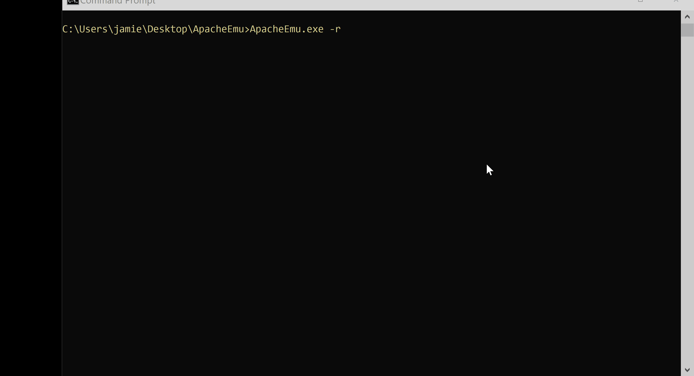

# Micro Emulation Plan: Remote Application Exploitation

This micro emulation plan targets remote exploitation activity. Exploitation of vulnerabilities (especially those that enable remote code execution) are very often abused to enable [TA0001 Initial Access](https://attack.mitre.org/tactics/TA0001/) (e.g., [T1190 Exploit Public-Facing Application](https://attack.mitre.org/techniques/T1190/)), but may also be included in post-compromise activity (e.g., [T1210 Exploitation of Remote Services](https://attack.mitre.org/techniques/T1210/) as part of [TA0008 Lateral Movement](https://attack.mitre.org/tactics/TA0008/)).

**Table Of Contents:**

- [Micro Emulation Plan: Remote Application Exploitation](#micro-emulation-plan-remote-application-exploitation)
  - [Description of Emulated Behaviors](#description-of-emulated-behaviors)
  - [CTI / Background](#cti--background)
  - [Execution Instructions / Resources](#execution-instructions--resources)
    - [Command Arguments](#command-arguments)
    - [Execution Demo](#execution-demo)
  - [Defensive Lessons Learned](#defensive-lessons-learned)
    - [Detection](#detection)
    - [Mitigation](#mitigation)

## Description of Emulated Behaviors

**What are we doing?** This module provides an easy-to-execute tool that:

1. Installs and starts a vulnerable web server (`Apache 2.4`)
2. Exploits the web server (`CVE-2021-41773`) to execute arbitrary commands
3. Cleans up the vulnerable web server and any associated artifacts

## CTI / Background

**Why should you care?** Exploitation of vulnerabilities in applications and services is very often abused as a means to enable adversary [TA0001 Initial Access](https://attack.mitre.org/tactics/TA0001/) (e.g., [T1190 Exploit Public-Facing Application](https://attack.mitre.org/techniques/T1190/)), but may also be included in post-compromise activity (e.g., [T1210 Exploitation of Remote Services](https://attack.mitre.org/techniques/T1210/) as part of [TA0008 Lateral Movement](https://attack.mitre.org/techniques/T1210/)).

This problem continually evolves and is exaggerated by the growing diversity and complexity of technologies within network environments. Risks from vulnerabilities in exposed applications can not always be remediated in time to prevent exploitation from adversaries. This micro plan uses [`CVE-2021-41773`](https://nvd.nist.gov/vuln/detail/CVE-2021-41773) as a medium to broadly emulate remote code execution (RCE) exploitation, where an adversary leverages a vulnerability to execute arbitrary code/commands/scripts.

## Execution Instructions / Resources

This module has been compiled into an easy-to-execute tool and is designed to execute on one host. The source code for this module is also provided if you wish to further customize and rebuild.

The standalone `ApacheEmu.exe` tool coordinates setup, exploitation, and cleanup of the vulnerable web server.

### Command Arguments

Default parameters are set to enable simple execution requiring no user inputs (i.e. double click), but the tool can also be run from the command-line in an reactive session with the `-r` option.

With no arguments, the tool will exploit the web serve, then execute three commands (`whoami`, `systeminfo`, `ipconfig /all`) using malicious HTTP requests.

The reactive session created with `-r` will setup the vulnerable web server, at which point the user can:

1. Type `setup` to exploit the server
2. Provide a series of arbitrary commands to be executed
3. Type `exit` to terminate the session (**this is required to guarantee proper cleanup**)

### Execution Demo



## Defensive Lessons Learned

### Detection

There are potentially multiple opportunities to detect exploitation activity, including pre-exploitation enumeration. Network and/or application logs may highlight potential malicious scanning activity such as [T1595.002 Active Scanning: Vulnerability Scanning](https://attack.mitre.org/techniques/T1595/002/) and [T1046 Network Service Discovery](https://attack.mitre.org/techniques/T1046/).

These same logs may also help identify attempted exploitation activity. It may vary by the specific vulnerability, but analysis of exploit chains may reveal detectable indicators. For example, `CVE-2021-41773` used for this emulation may be signatured using specific URI strings and resulting server status codes.

```yaml
detection:
    selection:
        cs-uri-query|contains:
            - '/cgi-bin/.%2e/'
            - '/icons/.%2e/'
            - '/cgi-bin/.%%32%65/'
            - '/icons/.%%32%65/'
            - '/cgi-bin/.%%%25%33'
            - '/icons/.%%%25%33'
        sc-status:
            - 200
            - 301
    condition: selection
```
*Code excerpted from [github.com/SigmaHQ/sigma](https://github.com/SigmaHQ/sigma/blob/6c153bff3f3b5bc7f0edefe430b2a6f903fd98b2/rules/web/webserver_generic/web_cve_2021_41773_apache_path_traversal.yml)*

Exploitation of applications may also be detectable through behavioral analytics highlighting:

- unusual process activity (such as commands and other processes spawning from server applications such as `httpd.exe`, `tomcat.exe`, `w3wp.exe`.)
- anomalous activity performed by user accounts associated with applications/services
- abnormal file activity in directories associated with these services

### Mitigation

Update and patch vulnerabilities as soon as possible. When updating software and patching vulnerabilities is not feasible, risks associated with remote exploitation may be reduced by considering:

- Isolating vulnerable applications (as well as filtering data flowing to/from these services), both at the network (segmentation) and host (application sandboxing) levels
- Limiting the privileges and accesses of application accounts to only those needed
- Applying vulnerability-specific fixes, such as [hardening filesystem directory permissions](https://www.rapid7.com/blog/post/2021/10/06/apache-http-server-cve-2021-41773-exploited-in-the-wild/) in the case of `CVE-2021-41773`
