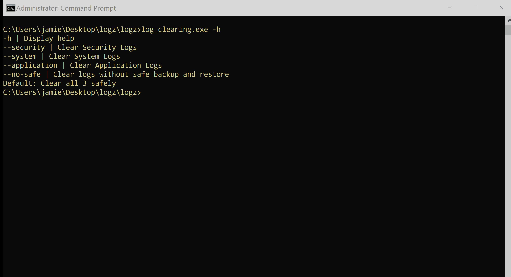
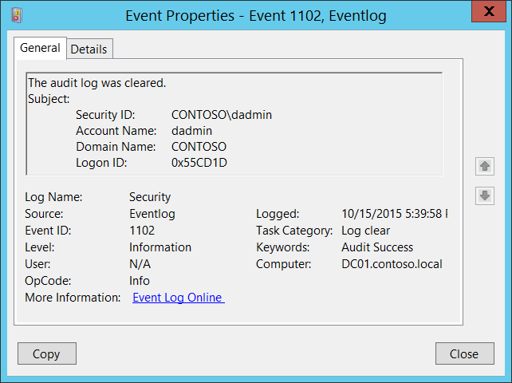

# Micro Emulation Plan: Clear Windows Event Logs

\*\***WARNING: THIS PLAN WILL DELETE YOUR WINDOWS EVENT LOGS AND CREATE A BACKUP COPY. USE CAUTION**\*\*

This micro emulation plan targets malicious activity associated with [T1070.001 Indicator Removal: Clear Windows Event Logs](https://attack.mitre.org/techniques/T1070/001/). Adversaries and malware often target clearing and/or disabling the native logging provided by Windows events in order to evade detections, while also inhibiting response and recovery from breaches.

You can access the binary for this micro plan as part of the [latest release](https://github.com/center-for-threat-informed-defense/adversary_emulation_library/releases). 

**Table Of Contents:**

- [Micro Emulation Plan: Clear Windows Event Logs](#micro-emulation-plan-clear-windows-event-logs)
  - [Description of Emulated Behaviors](#description-of-emulated-behaviors)
  - [CTI / Background](#cti--background)
  - [Execution Instructions / Resources](#execution-instructions--resources)
    - [Execution Demo](#execution-demo)
  - [Defensive Lessons Learned](#defensive-lessons-learned)
    - [Detection](#detection)
    - [Mitigation](#mitigation)

## Description of Emulated Behaviors

**What are we doing?** This plan provides an easy-to-execute tool that:

1. Saves a copy of Windows event log(s) (`security`, `system`, and/or `application`)
2. Executes events that will generate relevant log entries (e.g., adding a user, starting then stopping a service)
3. Clears the relevant log(s)

Instruction for restoring saved logs will be displayed in an popup window.

## CTI / Background

**Why should you care?** A wide variety of adversaries and malware target clearing the event logging provided by Windows events. This is often combined with [T1562.002 Impair Defenses: Disable Windows Event Logging](https://attack.mitre.org/techniques/T1562/002/) as well as tampering with other security tools discovered in victim environments (e.g., [T1562.001 Impair Defenses: Disable or Modify Tools](https://attack.mitre.org/techniques/T1562/001/)).

Clearing event logs is especially prevalent given this telemetry is often enabled and generated natively by the OS, but is also commonly consumed by other defensive tools/sensors (e.g., EDR) as well as utilized by incident and forensic investigators.

## Execution Instructions / Resources

This plan has been compiled into an easy-to-execute executable. The source code for this plan is also provided if you wish to customize and rebuild.

The `log_clearing.exe` tool executes the complete emulation functionality. The tool accepts the following arguments on the command-line or can simply be executed with defaults via  double-click:

- `-h` displays the help menu
- `--application` targets the Application log, restarting the `tvnservice` service to generate relevant events
- `--system` targets the System log, starting then stopping the `WMPNetworkSvc` service to generate relevant events
- `--security` targets the Security log, adding then deleting a `secretadmin` privileged user to generate relevant events
- `--no-safe` executes the module without first backing up relevant log files

By default (no arguments) the tool targets all 3 logs.

**NOTE: The executable must be run as administrator!**

During execution, a popup window will be displayed with instruction to restore log entries from the generated backup files.

### Execution Demo

## Defensive Lessons Learned

### Detection

Monitor processes and executed commands for potential attempts to tamper with or clear logs, such as execution of the [`wevtutil`](https://learn.microsoft.com/windows-server/administration/windows-commands/wevtutil) utility. PowerShell also has a [`Clear-EventLog`](https://learn.microsoft.com/powershell/module/microsoft.powershell.management/clear-eventlog) cmdlet.

Windows will also generate an event ([`Event ID 1102: "The audit log was cleared`](https://learn.microsoft.com/windows/security/threat-protection/auditing/event-1102)) when the Security log is cleared.

*Image source: [Microsoft Security auditing](https://learn.microsoft.com/windows/security/threat-protection/auditing/event-1102)*

Baselining event log size/volume may also help highlight potential anomalies, such as the absence of events in logs.

### Mitigation

Consider [customizing security access rights to Windows events](https://learn.microsoft.com/troubleshoot/windows-server/group-policy/set-event-log-security-locally-or-via-group-policy) (especially on sensitive or otherwise high-risk servers). Specific permissions can be set to control users' ability to `read`, `write`, and `clear` event logs through local or Active Directory group policies.

Also consider utilizing Windows Event Forwarding ([WEF](https://learn.microsoft.com/windows/security/threat-protection/use-windows-event-forwarding-to-assist-in-intrusion-detection)) to collect events centrally off individual devices.
